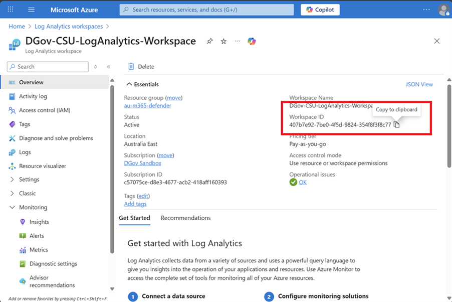
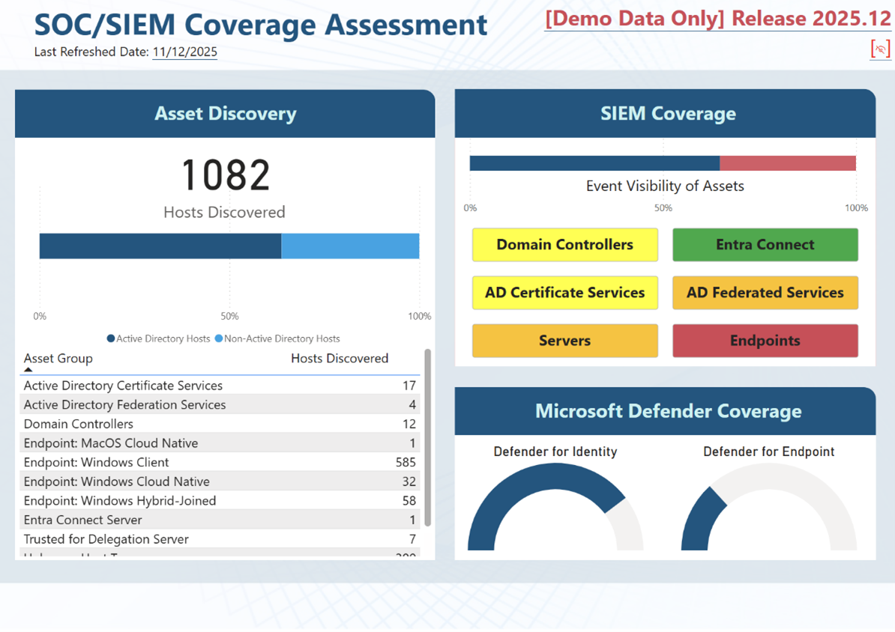
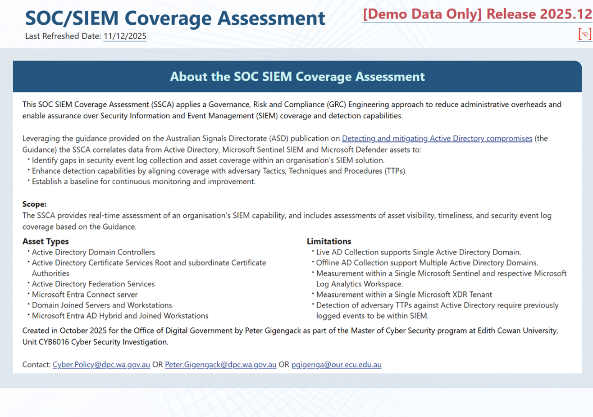
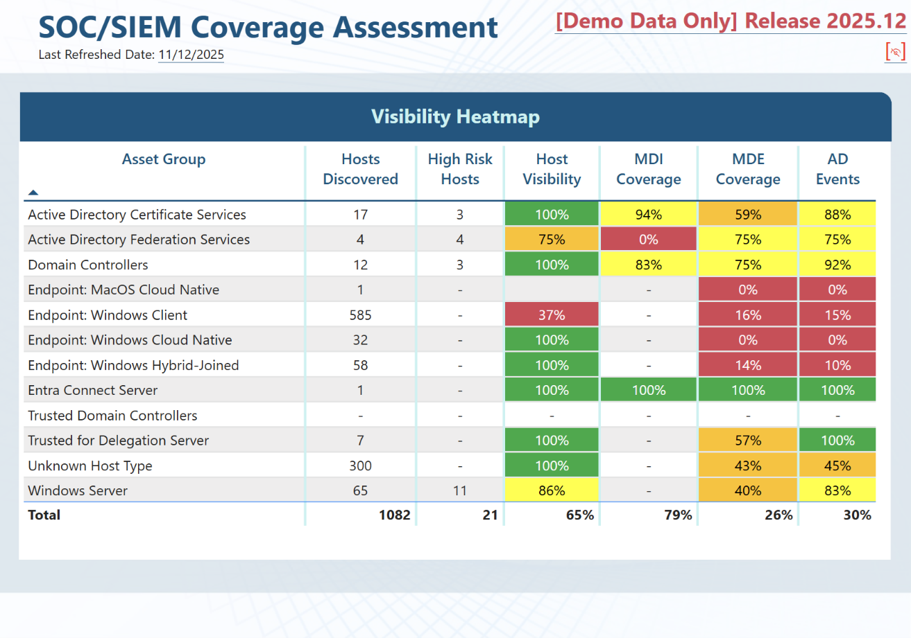
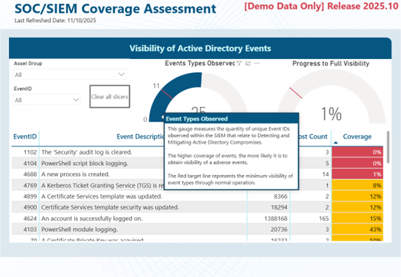
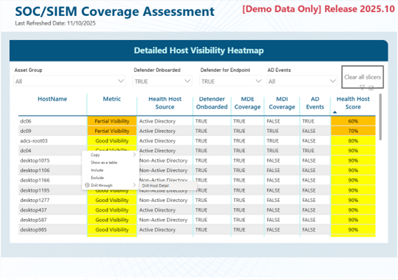
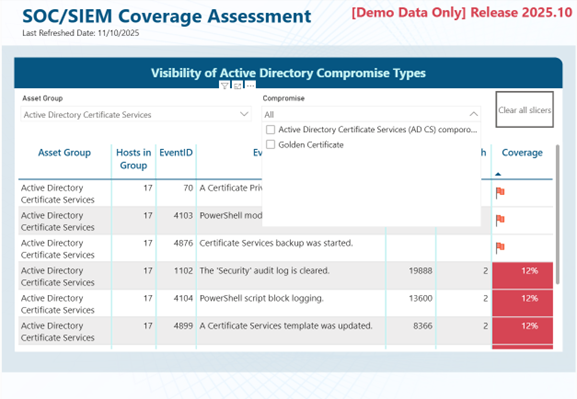
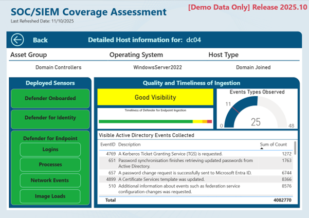
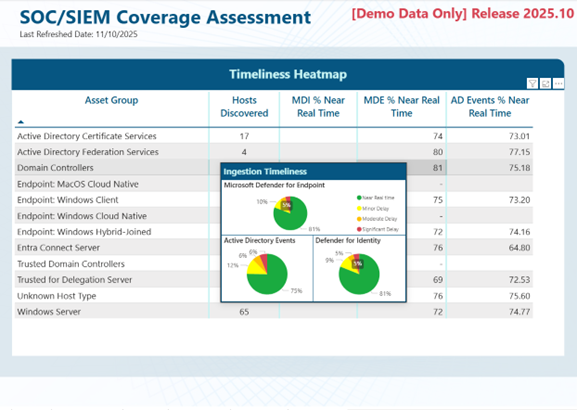
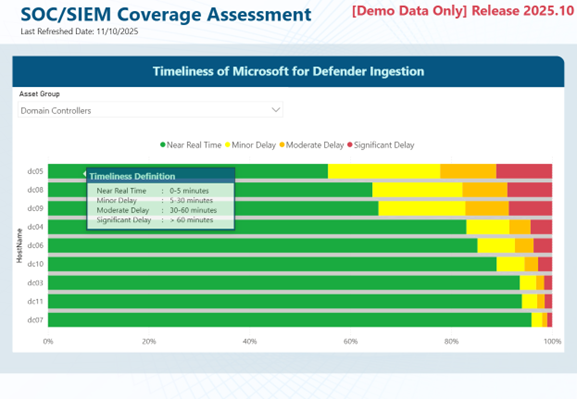

# SOC SIEM Coverage Assessment (SSCA)

## Introduction
The Office of Digital Government (DGov) has created a SOC SIEM Coverage Assessment (SSCA) tool to support Western Australian Government entities with their Cyber Security Capabilities. The SSCA uses freely available software to assist organisations in identifying gaps and recommending remediation activities to improve asset security event coverage across Microsoft Sentinel and Microsoft Defender.

## Purpose
Leveraging the guidance provided on the Australian Signals Directorate (ASD) publication on [Detecting and mitigating Active Directory Compromises](https://www.cyber.gov.au/business-government/detecting-responding-to-threats/detecting-and-mitigating-active-directory-compromises) (the Guidance) the SSCA correlates data from Active Directory, Microsoft Sentinel SIEM and Microsoft Defender assets to: 
 - Identify gaps in security event log collection and asset coverage within an organisation’s SIEM solution.
 - Enhance detection capabilities by aligning coverage with adversary TTPs. 
 - Establish a baseline for continuous monitoring and improvement.
## Scope
The SSCA provides real-time assessment of an organisation’s SIEM capability, and includes assessments of asset visibility, timeliness, and security event log coverage based on the Guidance.
### Asset Types
 - Active Directory Domain Controllers
 - Active Directory Certificate Services Root and subordinate Certificate Authorities 
 - Active Directory Federation Services
 - Microsoft Entra Connect server 
 - Domain Joined Servers and Workstations
 - Microsoft Entra AD Hybrid and Joined Workstations
### Limitations
- Measurement within a Single Microsoft Sentinel and respective Microsoft Log Analytics Workspace.
- Measurement within a Single Microsoft XDR Tenant
- Detection of adversary TTPs against Active Directory require previously logged events to be within SIEM.
- Live Active Directory data only available within a single Active Directory Domain.

# Assessment Tool
## Background
Microsoft’s Active Directory Domain Services, commonly known as Active Directory or AD, is the most widely used IAM within most Enterprise environments.  Originally released as part of Windows Server 2000, this 25-year-old platform is often targeted and exploited in cyber-attacks.  This is due to several factors including “its permissive default settings, its complex relationships, and permissions; support for legacy protocols, and lack of tooling for diagnosing Active Directory security issues.” (Australian Signals Directorate (ASD), 2025).

In 2025, ASD published guidance on [Detecting and mitigating Active Directory compromises](https://www.cyber.gov.au/business-government/detecting-responding-to-threats/detecting-and-mitigating-active-directory-compromises), that highlighted “17 common techniques used to target Active Directory” (ASD, 2025).  This guidance provides detailed information on security events within an Active Directory environment to identify compromises.
## Toolkit Components
This toolkit comprises of the following:

 1. User Guide (this README.MD)
 2. PowerBI Report Template [SSCA 0.7.pbit](SSCA%20v0.7.pbit)
 3. PowerShell Script [Get-ADDomainAssets.ps1](Get-ADDomainAssets.ps1)
 4. Microsoft Excel Document for [SSCA_SCHEMA](SSCA_SCHEMA.XLSX)

##Requirements
 - Active Directory Environment
	- User Permissions: Non-Privileged User Access (i.e. Domain User)
	- Active Directory PowerShell Module (when using [Get-ADDomainAssets.ps1](Get-ADDomainAssets.ps1))  Can be installed on a Member Workstation, Member Server or Domain Controller through Active Directory Role on Windows Server, or using the Remote Server Administrative Tools (RSAT)
 - Microsoft Power BI Desktop (Free Download)
	- [Microsoft Download Centre](https://www.microsoft.com/en-us/download/details.aspx?id=58494&msockid=3d052c0a8e7d6bbf079c3a5d8fcc6a1f)
	- [Microsoft Store](https://apps.microsoft.com/detail/9NTXR16HNW1T)
 - Microsoft PowerShell (when using [Get-ADDomainAssets.ps1](Get-ADDomainAssets.ps1))
	- Version 5
	- Script supports Constrained Language Mode
	- Execution Policy to Bypass/RemoteSigned/All for the unsigned PowerShell script.
 - Microsoft Azure Tenant with Log Analytics Workspace (LAW) 
	- Minimum Permission: [Log Analytics Reader](https://learn.microsoft.com/en-us/azure/azure-monitor/logs/manage-access?tabs=portal#log-analytics-reader) to the LAW Resource.  May be provisioned with other reader access such as Azure RBAC role [Security Reader](https://learn.microsoft.com/en-us/azure/role-based-access-control/built-in-roles#:~:text=482e%2Dba6b%2D9b8433878d10-,Security%20Reader,-View%20permissions%20for)
 - 	Microsoft 365 Tenant with Microsoft Defender Advanced Threat Hunt
	- Minimum User Permission: Security Reader
	- Microsoft Licence for Relevant Product Suite (e.g. M365 E5)
 - Microsoft 365 SharePoint or Local Folder Location
	- Used for [SSCA_SCHEMA.XLSX](SSCA_SCHEMA.XLSX)
	- Used for SSCA_lookup.csv (Generated by [Get-ADDomainAssets.ps1](Get-ADDomainAssets.ps1))
 - Microsoft Excel (for modification of SSCA_SCHEMA.XLSX)
## Setup Procedure
### Active Directory Domain Asset Collection
The SSCA relies on the collection of environment data from Active Directory with two methods:
  1. **Offline Asset Collection**
		This leverages the Get-ADDomainAssets.ps1 script to a comma-separated-value (CSV) file.  This supports the collection of Domain Assets across multiple Active Directory Domains.  
		
		Once all relevant data has been collected, it should be collated into a CSV file matching the format defined in the reference table specification
		
| Fields | Description | Examples |
|--|--|--|
| **FQDN** | The fully qualified domain name of the host. | “dc1.domain.wa.gov.au”    “Server2.agency.wa.gov.au”   “endpoint3.users.agency.wa.gov.au” |
| **ADDOMAIN** | The fully qualified domain name of the domain. | “agency.wa.gov.au”   “users.agency.wa.gov.au” |
| **ASSETGROUP** | The asset group the host belongs to with a separate entry for each asset group the host is associated with. | “DCS”   “ADFS”   “ENDPOINTS” |

2. **Live Refresh**
		This leverages the Native PowerBI Active Directory connectors to directly query active directory.  This method is only supported on Single Domain environments and has limitations on the asset groups identified via PowerBI.
		
The asset collection categorises each computer type into one or more of the asset groups defined in Table 2.  The supported detection and mapping features of each method have been provided a tick where the method
| Asset Group |	Description | SSCA Reference | Offline | Live Refresh | 
|--|--|--|--|--|
| Domain Controllers | All domain controllers within the environment. | 	DCS	 | ✔️ | ✔️ |
| Trusted Domain Controllers | All domain controllers of a domain that is trusted by another domain within the environment. |	TRUSTEDDOMAINS |	✔️ | - |	
| Active Directory Federation Services | All Active Directory Federation Services servers within the environment. | ADFS |	✔️1 | - |
| Active Directory Certificate Services	| All Root and Subordinate Certificate Authorities within the environment | ADCS |	✔️ |	✔️ |
| Trusted for Delegation Server	| All computers that are trusted for delegation within the environment (excluding domain controllers).	| TRUSTEDFORDELEGATION | 	✔️ | 	✔️ |
| Entra Connect Server |	All Microsoft Entra Connect servers in the environment. |	ENTRACONNECT |	✔️2 | 	Partial3 |
| Windows Server | All domain-joined windows servers within the environment. | SERVERS | 	✔️ | 	✔️ |
| Windows Endpoint | 	All domain-joined windows endpoints within the environment. | 	ENDPOINTS |	✔️ | ✔️ |

1 ADFS Detected by Security Group \*adfs\*   2 Entra Connect detected by Security Group filter *AAD*Connect*or  *Entra*Connect*, or via locating Entra host from default MSOL_ user account attributes.  3 Entra Connect host detected by Defender Advanced Threat Hunting and software inventory as part of Defender for Endpoint.

### Log Analytics Workspace (LAW) Identification
The Workspace Identification (Workspace ID) where SIEM Logs for Microsoft Sentinel is needed to for the PowerBI report.
1.	Browse to the Microsoft Azure Portal: https://portal.azure.com 
2.	Login with an organisation account with access to the LAW.
3.	Using the Search from the top of the portal, search for “Log Analytics Workspaces” and select it
4.	Locate the Log Analytics workspace where Sentinel logs are stored.
5.	Ensure you are within the “Overview” Blade item
6.	Locate the “Workspace ID” as observed the Essentials

7.	Copy this to the clipboard.  This will be required for the “Azure-LogAnalyticsWorkspace” PowerBI Report Parameter.

### PowerBI 
The PowerBI template [SSCA v0.7.pbit](SSCA%20v0.7.pbit) provided was developed to provide a streamlined assessment process using a close to real-time data.  This must be run with the user provided with:
* Read access to the Log Analytics Workspace
* Read access to the Microsoft Defender Advanced Threat Hunt. 
* Read access to a SharePoint Library or Local Folder where the prior Domain Asset Collection, SSCA_SCHEMA file was performed saved.  

###PowerBI First-Run
The first time you launch the [SSCA v0.7.pbit](SSCA%20v0.7.pbit) template, it will request a small set of parameters to configure the report for your environment:

At Minimum you will need to know the following information to load the PowerBI report as described in the table below:

| Parameter | Description |
|--|--|
| AD_FQDN |	Fully Qualified Domain Name for the Active Directory Domain used when AD_LiveData is set to TRUE |
| AD_LiveData | In a single AD domain, this setting allows the data-collection to be performed via Native PowerBI LDAP Based queries. |
| Azure-LogAnalyticsWorkspace |	Log Analytics Workspace ID queried as part of SSCA.  This must be obtained from Log Analytics Workspace (LAW) Identification Step 7. |
| Defender-API_Endpoint	| FQDN for Defender API.  https://learn.microsoft.com/en-us/defender-endpoint/api/api-power-bi |
| AD-InventoryCSV |	SharePoint/HTTPS or Local File Path to CSV file from ADDomainAssets PowerShell Export |
| SSCA_SCHEMA |	SharePoint/HTTPS Path or Local File Path to the SSCA_SCHEMA.XLSX File | 
| DemoData | 	This TRUE/FALSE setting loads an in-built dataset for Demo purposes.  This setting overrides all Live Data Collection options. |

Select or enter the appropriate options for your environment and press Load.  This may take some time depending on the size of your environment and internet connection speeds.  

If you need to be changed at a later point, these can be adjusted accordingly from the ribbon within the Home Tab -> Transform Data -> Edit Parameters

## Report Pages
### Dashboard
This provides an overview of key statistics within your organisation’s SIEM environment with a focus on highlighting Assets discovered across Active Directory and Non-Active Directory, and element of the current relative security posture and measurement.

### About the SSCA
Provides an overview of the functionality within the SSCA, scope, asset types and limitations.  This report page does not have functions that support the SSCA.

### Visibility Heatmap
This provides an overview per Asset group of the hosts discovered and respective coverage across the core components of a Microsoft Sentinel and Microsoft Defender based SIEM/SOC platform.  The heatmap is colour coded to enable easy identification of gaps within the assessment process.

### Visibility of Active Directory Events
This provides a view to explore areas of coverage against Asset Groups and Event IDs that relate to the Guideline.   This page in the report provides two key gauges to identify the relative progress the environment has in Maturing coverage of Active Directory related collected by the SIEM.

### Detailed Host Visibility Heatmap
This view provides an ability to obtain a more quantified viewpoint of each endpoint, filtering on key observables.  Right clicking a host and selecting “Drill-through” will enable more detail on a host’s coverage.

### Visibility of Active Directory Compromise Types
This provides the relative coverage of visible security events per asset group and respective common compromise types.  A red flag signifies that this asset group is not obtaining any visible events for that type of event.  An excess of visible events may indicate that an adverse event has occurred. 

### Detailed Host-Drill through 
Provides a detailed host information view including deployed sensors and for each host.

### Timeliness Heatmap
This provides the ability to observe the timeliness of the ingestion of Security Events to the SIEM.  A higher % of Near Real Time is better.  Hovering over an individual asset line item will reveal a detailed breakdown of ingestion per asset group.

### Timeliness of Defender for Endpoint Ingestion
This provides a representation of the timeliness of ingestion per host to enable identification of slow ingestion rates.

# Get-ADDomainAssets PowerShell Script
## Overview
The [Get-ADDomainAssets.ps1](Get-ADDomainAssets.ps1) PowerShell script has been developed for the SOC SIEM Coverage Assessment (SSCA) to assist organisations with the collection and collation of asset related information from Active Directory environments.  

For each Active Directory domain within the environment, the following information is collected by the tool:
 - **Domain Controllers**
		Primary collection: Get-ADDomain & Get-ADDomainController
- **Trusted Domain Controllers**
		Primary collection: Get-ADTrust
 - **Active Directory Federation Services Services**
		Primary collection: Group Members of “*adfs*” groups
 - **Active Directory Certificate Services root and subordinate Certificate Authorities**
		Primary Collection: Get-ADDomain – Global “Cert Publishes” well known SID.
 - **Servers that are trusted for delegation**
		Primary Collection: Get-AdComputer with TrustedForDelegation Flag.
 - **Entra Connect Servers**
		Primary Collection: Group Members of “*AAD*Connect*” or “*Entra*Connect*”
		Secondary Collection: Description within MSOL_ Accounts with hostname 
- **Servers**
		Primary Collection: Get-AdComputer filtered by Operating System
 - **Endpoints**
		Primary Collection: Get-AdComputer filtered by Operating System 

The Get-ADDomainAssets PowerShell Script has two primary modes:
- **Collect**
		Collect asset related Active Directory data from a target domain.   Repeat for individual domains.
- **Collate**
		Collate the collected data into a reference table for use as part of the SSCA.

## Requirements
The [Get-ADDomainAssets.ps1](Get-ADDomainAssets.ps1) PowerShell script requires:
 - Domain User Credentials (or cross-domain permissions obtained through a domain trust) for each target domain in the environment
 - A computer with
	 - PowerShell Version 5
	 - Active Directory PowerShell Module
	 - Script supports Constrained Language Mode
	 - Execution Policy to Bypass/RemoteSigned/All for the unsigned PowerShell script.
	 
## Collect Mode
By default, the collection mode will query the Active Directory domain it is executed in:

    PS C:\> .\Get-ADDomainAssets.ps1 -Collect

A different target domain can be specified by using the -Target parameter.

    PS C:\>.\Get-ADDomainAssets.ps1 -Collect –Target target.domain.com 

When targeting a domain that the currently logged in user either is not a user or does not have permission to, the script can be run with the context of a different user using the Runas /Netonly command provided there is network connectivity to the target domain:

    PS C:\> runas.exe /user:targetDomain\exampleUser /netonly powershell.exe
    PS C:\> .\Get-ADEnvironmentData.ps1 -Collect -Target targetDomain
    
## Collate Mode
Once the collection script has been run against all relevant domains, the results can be collated into a csv file (SSCA_LOOKUP.csv) for use as a reference table as part of a SSCA:

    PS C:\> .\Get-ADDomainAssets.ps1 -Collate

## Parameters
| Parameter | 	Description | 
|--|--|
| **Collect**	 | Collect asset related Active Directory data from target domain.|
| **Target** |The Fully Qualified Domain Name (FQDN) of the target domain controller or domain. |
| **Collate** |	Collates collected asset related Active Directory data into a reference table. |
| **Input** |	Input path where the collected data files will be retrieved for collation.  Defaults to current directory. | 
| **Output** | Output path where collated data will be saved.  Defaults to current directory. |

## Disclaimer 
The [Get-ADDomainAssets.ps1](Get-ADDomainAssets.ps1) Powershell script is provided as is without warranties or guarantees.  All results should be reviewed to ensure all relevant data has been collected and collated before attempting to complete the SSCA.
